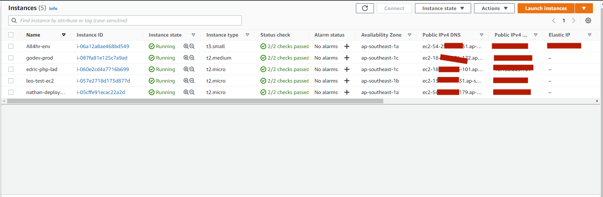

# Giới thiệu EC2

Amazon EC2 là gì?
Amazon Elastic Compute Cloud (Amazon EC2) là một cơ sở hạ tầng điện toán đám mây được cung cấp bởi Amazon Web Services (AWS) giúp cung cấp tài nguyên máy tính ảo hoá theo yêu cầu.
Amazon EC2 cung cấp các ứng dụng máy tính ảo hoá có thể mở rộng về khả năng xử lý cùng các thành phần phần cứng ảo như bộ nhớ máy tính (ram), vi xử lý, linh hoạt trong việc lựa chọn các phân vùng lưu trữ dữ liệu ở các nền tảng khác nhau và sự an toàn trong quản lý dịch vụ bởi kiến trúc ảo hoá đám mây mạnh mẽ của AWS.
Amazon EC2 sẽ cung cấp một hoặc máy chủ ảo có thể kết hợp với nhau để dễ dàng triển khai ứng dụng nhanh nhất và đảm bảo tính sẵn sàng cao nhất. Thậm chí về mặt thanh toán bạn dễ dàng biết được các mức chi phí cần thanh toán dựa trên thông tin tài nguyên bạn sử dụng.

# Amazon EC2 Instance Là Gì?
Amazon EC2 Instanc là một cloud server. Với một tài khoản bạn có thể tạo và sử dụng nhiều Amazon EC2 Instance. Các Amazon EC2 Instance được chạy trên cùng một server vật lý và chia sẻ memory, CPU, ổ cứng...

Tuy nhiên do tính chất của cloud service nên mỗi một Instance được hoạt động giống như một server riêng lẻ.

# Các đặc tính của Amazon EC2
1. Scaling:
Scaling Up/Down: Tăng/Giảm capacity(RAM, CPU,...) của Instance.
Scaling In/Out: Tăng/Giảm số lượng Instance.
2. Security:
Có thể thiết lập rank IP Private dành riêng cho EC2.
Sử dụng Security Group và Network ACLS để control inbound/outbound.
Có thể thiết lập IPsec VPN giữa Data Center và AWS Clound.
Delicated Instance -> Tạo EC2 trên 1 hardware physical dành riêng cho 1 khách hàng duy nhất.
3. Cost:
On-Demand Instance: Tính theo giờ, đáp ứng nhu cầu dùng trong thời gian ngắn. Dùng bao nhiêu, trả bấy nhiêu.
Reserved Instance: Cho phép trả trước 1 lượng Server cho 1 hoặc 3 năm. Chi phí chỉ bằng 75% so với On-Demand. Nêú không có nhu cầu sử dụng trong thời gian dài, bạn có thể sale tại Reserved Instance Marketplace

# Tạo và cấu hình EC2 Instance
* Truy cập vào EC2 Sau khi tạo tài khoản và đăng nhập vào trang của AWS bạn cần đi tới mục Services và truy cập vào trang EC2 dashboard hoặc vào trực tiếp địa chỉ URL https://console.aws.amazon.com/ec2/

* Tạo instance
Gõ trên thanh tìm kiếm EC2 hoặc chọn EC2 để vào dashboard. Ở đây sẽ hiện tất cả các list EC2 instance hiện đang có.

- Muốn tạo mới 1 EC2 instance hãy nhấn chọn Launch instances

* Để bổ trợ cho bài sample phần sau thì chúng ta sẽ tạo 1 EC2 chạy AWS linux 2 (dùng chạy web service)

## 1. Theo thứ tự các setup gồm: 
### 1.1 Đặt tên cho EC2 instance  
### 1.2 Chọn AMI (Amazon Machine Image), nó được hiểu gần giống như OS mà chúng ta muốn tạo, nó là 1 bản đã được cấu hình sẵn chúng ta chỉ cần lấy ra xài thôi. Với những bạn mới hoặc chỉ tạo aws cho mục đích học tập và sử dụng ít thì nên chọn các mục có ``_Free tier_`` để được free nhé.  
Ở đây mình sẽ chọn AWS linux 2 luôn nha  
### 1.3 Instance type  
Mục này là xác định cấu hình phần cứng cho máy chủ chúng ta, về CPU, Ram, cứ ``Free tier`` mà chọn nhé
### 1.4 Key pair  
Phần này là sẽ generate ra 1 key private key cho phép bạn SSH vào server của chúng ta để thực hiện các câu lệnh command line. Các bạn phải có kiến thức về cmd của Linux nhé
Ở đây bạn sẽ create new key pair, sau đó nhập tên bạn chọn. Download key .cer hoăc .pem và lưu file này thật kĩ nhé. Tránh public cho người ngoài biết vì nếu người khác có sẽ có thể truy cập vào server của bạn
### 1.5 Security Groups
> Security groups là một tập hợp các quy tắc tường lửa kiểm soát lưu lượng truy cập đến và đi từ phiên bản của bạn. Các quy tắc đến kiểm soát lưu lượng đến từ phiên bản của bạn và các quy tắc đi kiểm soát lưu lượng đi từ phiên bản của bạn. Bạn có thể chỉ định một hoặc nhiều nhóm bảo mật cho phiên bản của mình. Nếu bạn chỉ định nhiều nhóm bảo mật, tất cả các quy tắc sẽ được đánh giá để kiểm soát lưu lượng truy cập vào và ra. Nếu không có giá trị nào được chỉ định, giá trị của mẫu nguồn sẽ vẫn được sử dụng. Nếu giá trị mẫu không được chỉ định thì giá trị API mặc định sẽ được sử dụng.

Hiểu nôm na là nó giống tường lửa của Windows cho phép bạn mở port, cho phép bên ngoài truy cấp vào ứng dụng nào của server
Mình sẽ giữ mặc định là cho phép SSH.  

### 1.6 Storage
Phần này thì chỉ định các tùy chọn lưu trữ cho phiên bản. cấp phát bộ nhớ lưu trữ cho instances của chúng ta. Ở đây AWS EC2 cho phép tối 30GB miễn phí. Tuỳ vào nhu cầu mà bạn chọn GB mong muốn và đừng quá 30GB để được FREE

Vậy là chúng ta đã tạo xong 1 máy chủ VPS ở trên AWS mang tên EC2. Giờ đây mình sẽ hướng dẫn các bạn connect tới server qua 2 cách
C1. Là ssh bằng cmd của máy tính  
c2. Sử dụng phầm mềm Centos 8
