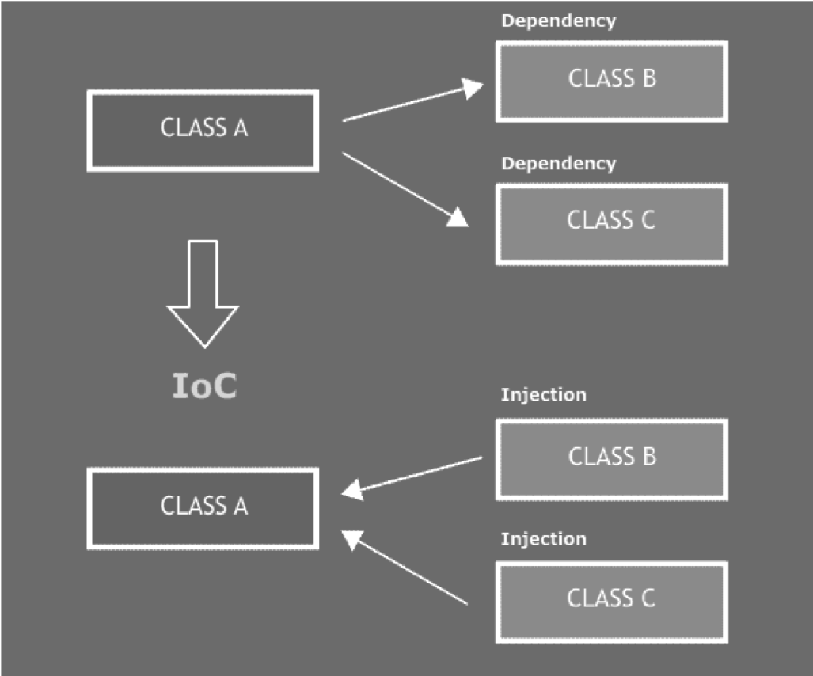
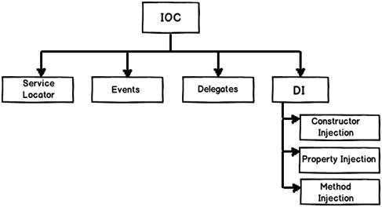
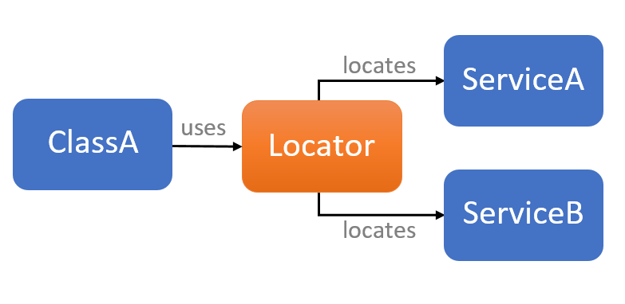

# Inversion Of Control Principle

## Tìm hiểu Dependency Inversion là gì?


Trước khi muốn tìm hiểu Inversion of control (IoC) thì bạn cần phải hiểu rõ Dependency Inversion là gì và quy tắc SOLID trong thiết kế, lập trình hướng đối tượng (OOP)Quy tắc SOLID thì bao gồm 5 quy tắc cơ bản, đó là: 
* Single responsibility principle
* Open/closed principle
* Liskov substitution principle
* Interface segregation principle
* **Dependency inversion principle**

Ở đây chúng ta quan tâm tới *Dependency inversion principle*   
Với cách code thông thường, các module cấp cao sẽ gọi các module cấp thấp. Module cấp cao sẽ phụ thuộc và module cấp thấp, điều đó tạo ra các dependency. Khi module cấp thấp thay đổi, module cấp cao phải thay đổi theo. Một thay đổi sẽ kéo theo hàng loạt thay đổi, giảm khả năng bảo trì của code.

Nguyên tắc là chỉ tạo 1 liên kết yếu giữa những class với nhau để giảm thiểu sự phụ thuộc quá vào 1 class, giúp cho việc bảo trì (maintainable), kiểm thử (testable) hay phát triển (extensible) dễ dàng hơn và nhanh chóng hơn vì chúng ta không cần phải can thiệp nhiều vào những class khác. 

Nguyên tắc Dependency Inversion còn quy định rằng các class phải giao tiếp với nhau thông qua giao diện (interfaces) chứ không được qua implementation. Một ví dụ để dễ hiểu về Dependency Inversion:Mặc dù có hình dáng khác nhau nhưng đèn huỳnh quang hoặc đuôi tròn đều có thể dễ dàng thay thế nhauỞ đây ta có thể hiểu interface chính là đuôi tròn còn implementation là bóng đèn tròn và bóng đèn huỳnh quang. Ta có thể hoán đổi giữa 2 loại bóng đèn bởi ổ điện chỉ quan tâm tới interface là cái đuôi tròn chứ không cần quan tâm tới implementationTrong code cũng tương tự như vậy, khi áp dụng Dependency Inversion, bạn chỉ cần quan tâm tới interface. Để kết nối với database, bạn chỉ cần gọi hàm Get hay Save … của Interface IDataAccess. Khi thay database, chỉ cần thay implementation của interface này.

## Inversion of Control là gì?
Inversion of Control có thể hiểu là một nguyên lý thiết kế trong công nghệ phần mềm. Các kiến trúc phần mềm được được áp dụng thiết kế này sẽ được đảo ngược quyền điều khiển so với kiểu lập trình hướng thủ tục. Trong lập trình hướng thủ tục thì các đoạn mã được thêm vào sẽ gọi các thư viện nhưng với IoC thì các IoC container sẽ chích những dependencies vào khi nó khởi tạo. Nói một cách tóm tắt thì IoC là một nguyên lý thiết kế được tạo ra để các code tuân thủ theo nguyên lý Dependency Inversion. 


Để có thể hiểu rõ hơn về IoC, ta có thể lấy một ví dụ như sau:   
Giả sử có 1 class mẹ là A và hai class con là B và C ( lúc này B và C sẽ được gọi là các dependencies). Với mô hình không sử dụng IoC thì Class A cần phải khởi tạo và điều khiển hai class B và C, bất kỳ thay đổi nào ở Class A đều dẫn đến thay đổi ở Class B và C. Một thay đổi sẽ kéo theo hàng loạt những thay đổi khác từ đó làm giảm khả năng bảo trì của code. Trong khi đó, nếu trong mô hình sử dụng IoC, các class B và C sẽ được đưa đến độc lập so với class A thông qua một bên thứ ba, từ đó các class không phụ thuộc lẫn nhau mà chỉ phụ thuộc vào interface. Điều này cũng đồng nghĩa rằng sự thay đổi ở class cấp cao sẽ không ảnh hưởng tới các class cấp thấp hơn.
```
<?php

class A
{
    function __construct()
    {
        $b = new B();
        $c = new C();
    }

    public function callAll(){
        $b->call();
        $c->call();
    }
}

class B
{
    public function call()
    {
        echo "This is function call() of Class B</br>";
    }
}

class C
{
    public function call()
    {
        echo "This is function call() of Class C</br>";
    }
}

$a = new A();
$a->callAll();
```



``` 
Ở mô hình không IoC, Class A khi cần chủ động tạo ra đối tượng lớp Class B và Class C (nó nắm quyền khởi tạo, điều khiển) 
```

```
Với mô hình IoC thì class A không tự khởi tạo cũng không chịu trách nhiệm quản lý Class B, Class C. Nó nhận được hai dependency này từ bên ngoài thông qua một cơ chế nào đó (như bằng setter, bằng tham số hàm tạo lớp A, bằng gán thuộc tính ...)
```

Một vài mô hình được sử dụng để triển khai Inversion of Control (IoC) như: 
* Service Locator
* Events
* DI (Dependency Injection).    




Một số lợi ích mà IoC đem lại:  

* Có sự tách rời việc thực hiện một nhiệm vụ nhất định khỏi quá trình thực thi.
* Giúp việc chuyển đổi giữa các implementations trở nên dễ dàng hơn.
* Việc thay thế các mô-đun không có tác dụng phụ đối với các mô-đun khác.
* Dễ dàng hơn trong việc test chương trình bằng cách tách một thành phần hoặc mock các dependencies của nó, cho phép chúng communicate thông qua contracts.

Ngoài ra IoC cũng sẽ có 1 số nhược điểm như sau:
* Khái niệm DI khá “khó tiêu”, các developer mới sẽ gặp khó khăn khi học.
* Sử dụng interface nên đôi khi sẽ khó debug, do không biết chính xác module nào được gọi.
* Làm tăng độ phức tạp của code.

## Mô hình lập trình Service Locator

Ngoài các mô hình phổ biến như MVC, MVP ... còn có loại Service Locator khá phổ biến (trong PHP, trong C# ...). Nó thể hiện hoạt động của mô hình như đồ họa sau.



Sử dụng mô hình này có nghĩa cần có cơ chế sao cho tất các các tiến trình (các đối tượng, dịch vụ ...) được đưa vào quản lý bởi một trung tâm được gọi là Service Locator, từ trung tâm này các lớp muốn sử dụng dịch vụ nào thì Locator sẽ cung cấp (khởi tạo nếu chưa, và trả về dịch vụ cho đối tượng sử dụng). 

### Lợi ích khi dùng mô hình lập trình Service Locator
Đây là mô hình hoạt động đơn giản như một cơ chế liên kết với nhau lúc thực thi. Cho phép code được thêm vào lúc chạy mà không cần biên dịch lại, hay khởi động lại một tiến trình nào đó.
Ứng dụng tự tối ưu vào lúc chạy bằng cách thêm bớt các nội dung từ trung tâm.
Có thể chia nhỏ thư viện lớn, ứng dụng lớn và liên kết chúng lại với nhau thông qua trung tâm đăng ký này.
### Các hạn chế của Service Locator
Mọi thứ bên trong Service Locator là hộp đen tách biệt với phần còn lại của hệ thống. Điều này có thể dẫn đến khó phát hiện lỗi, có thể dẫn đến không ổn định.
Trung tâm đăng ký là duy nhất, điều này có thể dẫn tới tình trạng nghẽn với các ứng dụng nhiều tiến trình.
Có thể dẫn tới các lỗ hổng vì cho phép mã được inject vào ứng dụng.

## Mô hình lập trình Dependency Injection (DI)
Dependency injection – DI cũng là một trong những design pattern được sử dụng để triển khai IoC.  
Nguyên tắc cơ bản của DI là làm cho module cấp cao phụ thuộc vào module cấp thấp thông qua injector, hay nói cách khác, muốn tạo instance module cấp cao, ta phải tạo instance của module cấp thấp và inject nó vào module cấp cao thông qua injector. Injector ở đây có thể là constructor hay setter và interface. Theo nguyên tắc trên dường như bạn cảm thấy nó có vẻ mâu thuẫn với Dependency inversion principle (DIP), tuy nhiên nếu xem xét kỹ thì không hẳn là vậy. Nguyên tắc của DI khác ở chỗ nó sẽ tạo ra sự phụ thuộc của module cấp cao và module cấp thấp thông qua abstraction chứ không phải theo cách trực tiếp. Như vậy, module cấp cao sẽ sử dụng Service (module cấp thấp abstraction) thông qua injector mà không cần quan tâm đến việc khởi tạo của nó.

Chúng ta sẽ lấy ví dụ sau để dễ hiểu rõ hơn. Giờ bạn tạo ra 2 lớp mà chúng không sử dụng cơ chế DI, sau đó viết lại có sử dụng DI để xem sự khác biệt:


Lớp thứ nhất là StockItem biểu diễn mặt hàng trong kho (số lượng, tình trạng). Lớp thứ 2 biểu diễn mặt hàng bán trên trang web, liên quan đến mặt hàng lưu trữ trong kho.
```
class StockItem {

    private $quantity;
    private $status;

    public function __construct($quantity, $status){
        $this->quantity = $quantity;
        $this->status   = $status;
    }

    public function getQuantity(){
        return $this->quantity;
    }

    public function getStatus(){
        return $this->status;
    }

}
```
Còn đây là class Product
```
class Product {
    private $stockItem;
    private $code;

    public function __construct($code, $stockQuantity, $stockStatus){
        $this->stockItem  = new StockItem($stockQuantity, $stockStatus);
        $this->code        = $code;
    }

    public function getStockItem(){
        return $this->stockItem;
    }

    public function getCode(){
        return $this->code;
    }
}
```

Giờ để khởi tạo 1 đối tượng Product ta có:
```
$product = new Product("101010", 50, "Áo Dài");
var_dump($product->getStockItem());
```

Code trên tạo ra lớp Product, khi khởi tạo Product thì cũng khởi tạo đối tượng StockItem trong hàm tạo của lớp Product bằng cách truyền các tham số $stockQuantity, $stockStatus.

Với cách sử dụng code như trên, đó là đoạn code bình thường không có vấn đề gì về logic, nhiều khi đánh giá là đoạn code tốt. Tuy nhiên khi vận hành, bảo trì, mở rộng có thể phát sinh một số vấn đề:

* StockItem và Product là một cặp cố định, vậy thì một lúc nào đó StockItem thay đổi tham số khởi tạo (thêm, bớt) thì sao? Vậy bạn cần phải viết lại hàm khởi tạo trong Product cũng như tất cả các lớp có sử dụng phiên bản cũ của StrockItem
* Product biết quá nhiều, ở đây là số lượng và trạng thái của sản phẩm trong kho. Điều này giảm đi tính độc lập, đóng kín của lập trình hướng đối tượng.
* Khi viết unit test cho code trên, vì Product khởi tạo stockItem trong hàm tạo, nên không thể tạo Unit test cho Product mà không tạo Unit test cho stockItem


Giờ chúng ta sẽ viết lại class **Product** với **Dependency Injection**:
```
class Product {
    private $stockItem;
    private $code;

    public function __construct($code, StockItem $stockItem){
        $this->stockItem   = $stockItem;
        $this->code        = $code;
    }

    public function getStockItem(){
        return $this->stockItem;
    }

    public function getCode(){
        return $this->code;
    }
}

$stockItem = new StockItem(50, "Áo Dài");
$product = new Product("101010", $stockItem);
var_dump($product->getStockItem());
```
Với cách viết thứ 2 này, đối tượng StockItem không còn khởi tạo bên trong hàm tạo Product nữa, mà nó được truyền vào (tiêm) Product thông qua chính đối tượng StockItem, như vậy khi thay đổi cách khởi tạo StockItem thì lớp Product không phải thay đổi gì. Đó chính là khái niệm **Dependency Injection**.

### Các kiểu Dependency Injection
```Constructor Injection - Inject qua hàm tạo```  
    Ở ví dụ trên chính là sử dụng kiểu Constructor Injection, với cách này có một số đặc điểm

* Khi một lớp phụ thuộc cần một lớp triển khai để hoạt động thì sẽ sử dụng cách này để đảm bảo lớp đó được cung cấp cho đối tượng phụ thuộc.
* Do truyền đối tượng qua hàm tạo, nên cần đảm bảo thành phần phụ thuộc này không bị thay thế trong suốt quá trình tồn tại của đối tượng
* Sử dụng cách này khi kế thừa các lớp việc xử lý hàm tạo khá phức tạp

```Setter Injection - Inject thông qua hàm setter```

Thành phần phụ thuộc được tiêm (truyền) vào đối tượng thông qua hàm setter. Ví dụ:
```
class Product {
    private $stockItem;
    private $code;

    public function __construct($code){
        $this->code        = $code;
    }

    public function getStockItem(){
        return $this->stockItem;
    }

    public function getCode(){
        return $this->code;
    }

    public function setStockItem(StockItem $stockItem){
        $this->stockItem = $stockItem;
    }
}

$stockItem = new StockItem(50, "Áo Dài");
$product = new Product("101010");
$product->setStockItem($stockItem);
var_dump($product->getStockItem());
```

Như vậy đối tượng phụ thuộc vào $stockItem được cài vào Product thông qua một hàm setter: setStockItem($stockItem). Với cách này:

* Cho phép tùy chọn các phụ thuộc và lớp có thể tạo ra với các giá trị mặc định
* Thêm các thành phần phụ thuộc một cách đơn giản thông qua hàm setter mà không làm hỏng logic của code.

```Interface Injection - Inject qua giao diện lớp```  
Với cách này định nghĩa một giao diện sao cho các thành phần phụ thuộc được tích hợp vào mã triển khai giao diện:
```
interface ProductInterface {
    public function getStockItem();
    public function setStockItem(StockItem $stockItem);
```

Khi triển khai giao diện ProductInterface cần cung cấp StockItem thông qua định nghĩa hàm của giao diện